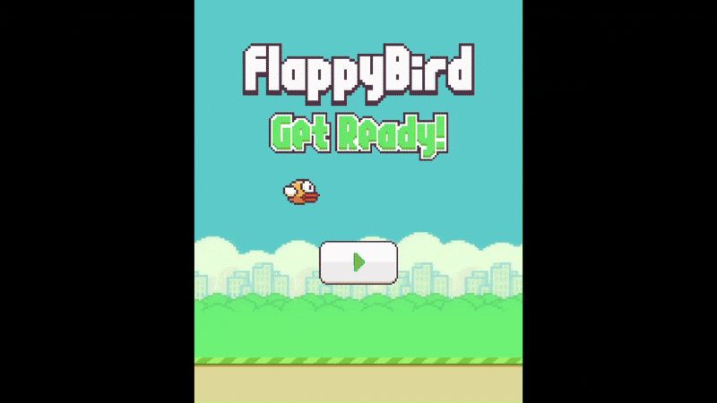

# Flappy Bird - SFML

## 📌 Project Overview
This is a simple Flappy Bird clone developed using **SFML** as part of the Object-Oriented Programming course. The game features real-time scoring, collision detection, animations, and sound effects.



## 🚀 Features
- Simple & fun gameplay
- 2D graphics with **SFML**
- Collision detection
- Real-time score tracking
- Animations

## 📂 Technologies Used
- **C++**
- **SFML (Simple and Fast Multimedia Library)**

## 🎮 How to Play?
- Press **Space** to jump
- Avoid obstacles and score as high as possible!

## 🛠️ Installation & Setup
Follow these steps to clone and run the project locally:

### 1️⃣ Clone the Repository
```bash
git clone https://github.com/alelena14/flappy-bird
cd flappy-bird
```

### 2️⃣ Install SFML
Make sure you have **SFML** installed on your system. You can install it as follows:
- **Windows** (Using vcpkg):
  ```bash
  vcpkg install sfml
  ```
- **Linux** (Ubuntu/Debian):
  ```bash
  sudo apt-get install libsfml-dev
  ```
- **macOS** (Using Homebrew):
  ```bash
  brew install sfml
  ```

### 3️⃣ Build the Project
Compile the project using a C++ compiler with SFML support:
```bash
g++ -std=c++17 -o flappy_bird main.cpp -lsfml-graphics -lsfml-window -lsfml-system -lsfml-audio
```

### 4️⃣ Run the Game
```bash
./flappy_bird
```

## ✅ Running the Project in Visual Studio
1. Open the project in **Visual Studio**.
2. Configure the **SFML** include and library directories.
3. Set up the linker settings for SFML.
4. Build and run the project.


## 🤝 Contributing
Feel free to fork this repository and submit pull requests!

---

### 🔗 Contact
For any questions, reach out via [your email] or open an issue in the repository.
